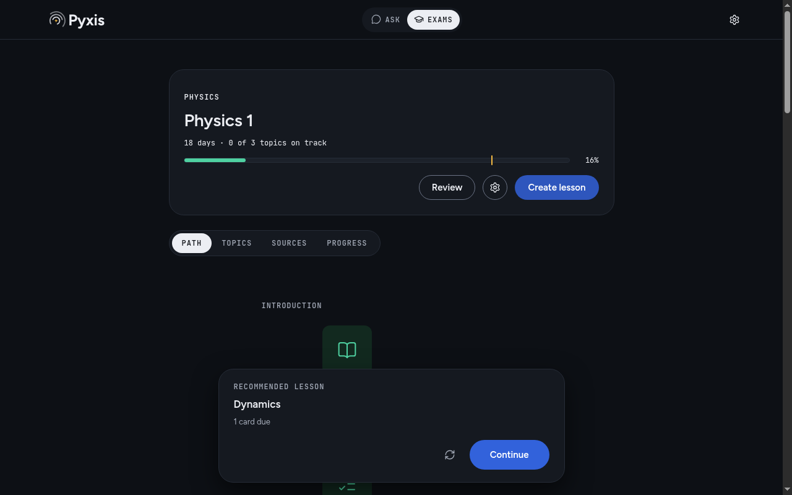
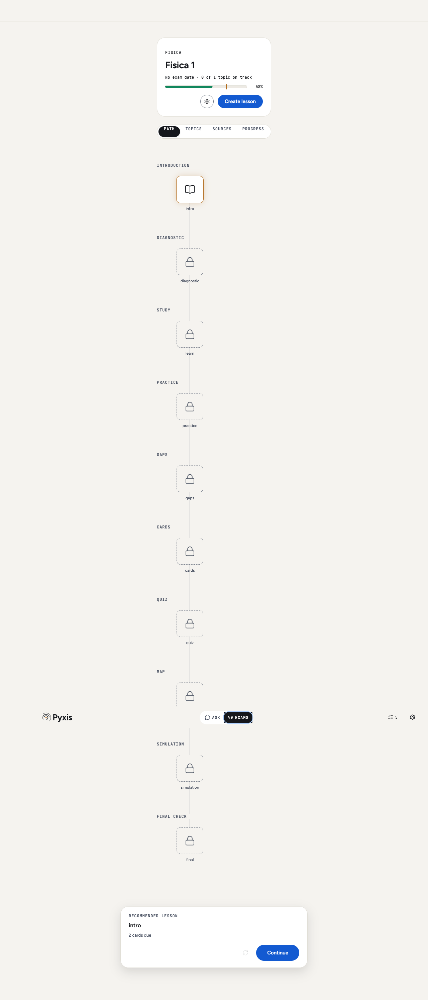

# PoliTost Pyxis

Pyxis is an open-source study tutor for university students. It runs on your computer without a Pyxis account or subscription. You choose the model provider. That provider may require a paid account, subscription or API credit.

Import course material, build a study plan around your exam date, and work through cited lessons, quizzes, flashcards and written simulations. Tutor chat, concept maps, a whiteboard, graphing and local Python tools sit alongside the plan. PoliTost smartbooks `.ptsb` retain their chapters and exercise citations.

| Dark theme                                                  | Light theme                                                   |
| ----------------------------------------------------------- | ------------------------------------------------------------- |
|  |  |

## Install

Download the verified macOS Apple Silicon installer from [GitHub releases](https://github.com/SuperTost100/politost-pyxis/releases). Check SHA256SUMS before installation. Other-platform packages await hosted CI validation.

- **macOS:** use the DMG for Apple Silicon `arm64` or Intel `x64`. Open it, drag PoliTost Pyxis to Applications, and open the app. Builds are ad-hoc signed, without Apple notarization. If macOS blocks a verified build, use System Settings → Privacy & Security → Open Anyway. Do not disable Gatekeeper globally.
- **Windows:** run the NSIS `.exe` installer. Unsigned builds may show SmartScreen. For a build whose origin and checksum you have verified, choose More info → Run anyway.
- **Linux:** install the `.deb` with your package manager, or make the `.AppImage` executable with `chmod +x` and launch it. Some systems need FUSE for AppImage. Linux API-key storage requires a working OS keyring; Pyxis refuses the plaintext `basic_text` backend.

On first launch, choose your profile and language, then configure and test an engine in Settings. Claude Code, Codex, Cursor Agent and Antigravity use their installed, authenticated CLIs in text-only mode. Anthropic and OpenAI use an API key saved through OS encryption. Model availability depends on your provider account.

## Privacy

Pyxis stores sources, study history and generated content in a local workspace. A model request sends the prompt, selected source passages and any supported attachments to your selected provider. Provider retention and billing rules apply. Importing a link contacts that website. Optional local-model and Python-runtime downloads contact their distributors. There is no Pyxis cloud service.

Crash reporting is off by default; its current switch records a preference and does not submit reports. Backup files and exports may contain private course material. API keys are outside the workspace and excluded from backups. See [SECURITY.md](SECURITY.md) for storage locations and network details.

## Build from source

Use Node.js 26, npm and the build tools required by native Node modules. On macOS install Xcode Command Line Tools; on Windows install Visual Studio C++ build tools and Python; on Linux install a C++ toolchain and Python. The lockfile and `vendor/` tarballs are part of the build input.

```bash
npm ci
npm run dev
npm run typecheck
npm test
npm run test:e2e
npm run dist
```

`postinstall` rebuilds SQLite bindings for Electron. Unit tests use Electron's Node runtime for the same ABI. Linux UI tests need a display, for example `xvfb-run -a npm run test:e2e`. Installers appear in `dist/`. `npm run dist -- --mac --arm64 --publish never` selects a target explicitly.

Read [CONTRIBUTING.md](CONTRIBUTING.md), [architecture](docs/architecture.md), [engines](docs/engines.md), [scheduler](docs/scheduler.md), [mastery](docs/mastery.md) and [plan portability](docs/plan-file.md). The MIT license covers Pyxis code; dependency licenses are listed in [third-party notices](docs/notices.md).
