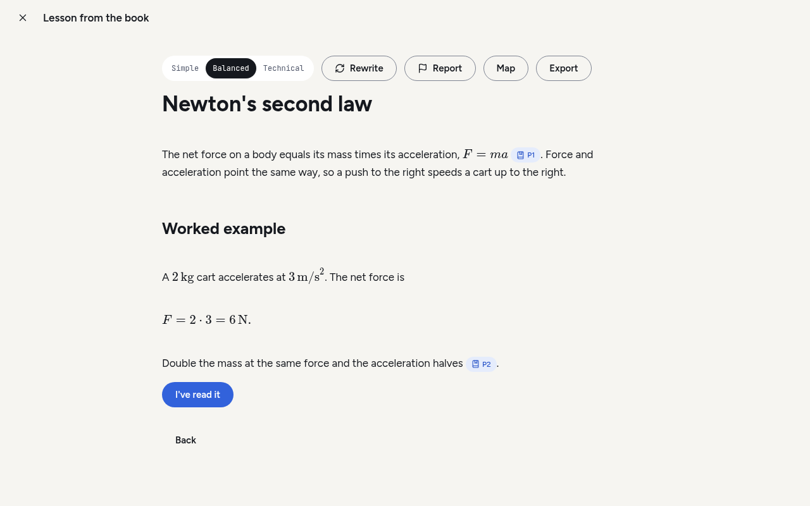
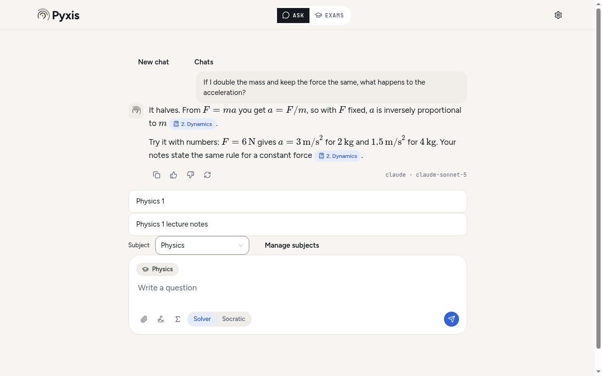

<p align="center">
  <picture>
    <source media="(prefers-color-scheme: dark)" srcset="src/renderer/src/design-system/logo/pyxis-lockup-dark.svg">
    
  </picture>
</p>

<p align="center">
  A study tutor that runs on your own computer.<br>
  Give it your course material and an exam date. It builds the plan and cites your sources in every lesson.
</p>

<p align="center">
  <a href="https://github.com/SuperTost100/politost-pyxis/releases/latest"></a>
  <a href="https://github.com/SuperTost100/politost-pyxis/actions/workflows/ci.yml"></a>
  <a href="LICENSE"></a>
</p>

<p align="center">
  <a href="#install">Download</a> ·
  <a href="docs/README.md">Documentation</a> ·
  <a href="CONTRIBUTING.md">Contributing</a> ·
  <a href="SECURITY.md">Security</a>
</p>

<picture>
  <source media="(prefers-color-scheme: dark)" srcset="docs/screenshots/plan-dark.png">
  
</picture>

## Why Pyxis

A fluent answer is no use if you can't check it. Pyxis answers from the material you import. Lessons and chat replies carry numbered citations that open the exact passage they came from, and each flashcard shows its source passage on the back. When Pyxis writes from general knowledge instead, it labels the text that way.

Pyxis has no account, no subscription and no server of its own. The workspace is a SQLite file and a folder of blobs on your disk. You connect the AI tools you already use: Claude Code, Codex, Cursor Agent or Antigravity, or an Anthropic or OpenAI API key. Your provider may charge for usage. Pyxis doesn't.

The app is in English and Italian, with dark and light themes.

## What you can do

**Plan for an exam.** Import your sources, set the exam date and a target score, and Pyxis splits the material into topics. Each topic gets a lesson, practice, flashcards and a gap check, and the plan ends with a timed simulation and a final check. The next step is always on screen, chosen from due cards, open gaps, mastery and days left. [The rules are documented](docs/mastery.md), not hidden in a model.

**Learn from cited lessons.** Pick a simple, balanced or technical register. Math renders with KaTeX. Rewrite a lesson, flag a wrong claim, export it as PDF, or turn the topic into a concept map.

**Practise.** Quizzes mix multiple choice, true/false, matching, fill-in and open questions. The model grades open answers and written simulations against a reference answer and tells you which points you missed. Flashcards are scheduled with [FSRS](docs/scheduler.md) and export to Anki.

**Close knowledge gaps.** Two wrong answers on a topic in one quiz open a gap. Pyxis asks the model what misconception the answers show, builds a drill for it, and closes the gap after two clean sessions on different days.

**Ask the tutor.** The chat cites your library and can attach photos and documents. Solver mode works the problem through with you. Socratic mode holds back the answer and asks one question at a time until you get there. The Σ button opens a formula keyboard, which also works in quiz, practice and simulation answers. Pyxis also has a whiteboard, a graphing tool and a local Python sandbox with NumPy, SymPy and Matplotlib.

**Share and back up.** Export a plan as a portable file with its lessons, cards and cited excerpts, and include your progress if you want to. Back up the whole workspace to one ZIP and restore it on another computer.

Pyxis reads PDF, Word (`.docx`), PowerPoint (`.pptx`), Markdown, plain text, web pages, photos (JPEG, PNG, WebP, HEIC) and [PoliTost smartbooks](https://github.com/SuperTost100/politost-content) (`.ptsb`), which keep their chapters and exercises. Scanned pages go through local OCR or your model's vision support.

<table>
  <tr>
    <td width="50%">
      <picture>
        <source media="(prefers-color-scheme: dark)" srcset="docs/screenshots/lesson-dark.png">
        
      </picture>
    </td>
    <td width="50%">
      <picture>
        <source media="(prefers-color-scheme: dark)" srcset="docs/screenshots/ask-dark.png">
        
      </picture>
    </td>
  </tr>
  <tr>
    <td>Citation chips open the passage behind a claim.</td>
    <td>The tutor answers from your notes and names the model.</td>
  </tr>
</table>

## Install

Download the file for your system from the [latest release](https://github.com/SuperTost100/politost-pyxis/releases/latest).

| System               | File                                                |
| -------------------- | --------------------------------------------------- |
| macOS, Apple Silicon | `PoliTost.Pyxis-<version>-arm64.dmg`                |
| macOS, Intel         | `PoliTost.Pyxis-<version>.dmg`                      |
| Windows x64          | `PoliTost.Pyxis.Setup.<version>.exe`                |
| Linux x64            | `politost-pyxis_<version>_amd64.deb` or `.AppImage` |

The builds aren't signed with a paid certificate, so your OS will warn you the first time. Check the download before you get past the warning:

```bash
# in the folder with the download and SHA256SUMS
shasum -a 256 --check --ignore-missing SHA256SUMS      # macOS
sha256sum --check --ignore-missing SHA256SUMS          # Linux
gh attestation verify <file> --repo SuperTost100/politost-pyxis
```

On Windows, `Get-FileHash <file>` prints the hash to compare with `SHA256SUMS`. The `gh attestation` line checks that GitHub Actions built the file from this repository.

- **macOS.** Open the DMG and drag Pyxis to Applications. If macOS refuses to open it, go to System Settings → Privacy & Security and choose Open Anyway. Don't turn Gatekeeper off for the whole system.
- **Windows.** Run the installer. If SmartScreen stops it, choose More info → Run anyway.
- **Linux.** Install the `.deb` with your package manager, or `chmod +x` the AppImage and run it (some distributions need FUSE for that). Saving an API key needs a working keyring such as GNOME Keyring or KWallet. Pyxis refuses to store keys in plain text.

Pyxis checks GitHub for a new release at most once a day and links you to it. It never installs updates by itself.

### First launch

First setup takes four short steps, and Skip on the first screen jumps past all of them:

1. **About you.** Name, level, school and course. They stay on your computer.
2. **AI engines.** Pyxis looks for the tools below and tells you what it found. It sends nothing to a model at this step.
3. **Photos and scans.** Optionally download the English and Italian OCR data (about 7 MB), so Pyxis can read photos and scans on your computer.
4. **Privacy.** The crash-report switch. For now it only records your choice. Pyxis has no crash reporter yet.

| Engine        | How it connects                           |
| ------------- | ----------------------------------------- |
| Claude Code   | Your installed and signed-in `claude` CLI |
| Codex         | Your installed and signed-in `codex` CLI  |
| Cursor Agent  | Your installed and signed-in `agent` CLI  |
| Antigravity   | Your installed and signed-in `agy` CLI    |
| Anthropic API | API key, encrypted with the OS key store  |
| OpenAI API    | API key, encrypted with the OS key store  |

Pyxis runs the CLIs in text-only mode, so they can't use their shell, file or web tools. It picks an engine and model for each job itself. Chat and maps get a fast model, lessons a mid-range one, and plans and grading the strongest. With several CLIs signed in, it spreads the work across them. API keys come into play only when no CLI is ready, because they bill per token. To pin a different choice, open Settings → Engines. [Engines](docs/engines.md#automatic-choice) lists the defaults for each combination.

## Your data

Sources, plans, progress and generated material stay in a local workspace. Settings → Data shows its path and lets you move it.

These actions send data off your computer:

- **Generating or grading.** The prompt, the source passages it needs and any attachments go to the provider you picked. Its retention and billing rules apply.
- **Importing a link.** Pyxis fetches the page from that site.
- **Optional downloads.** The search model, the Python runtime and the OCR language files are fetched once, after you agree, and checked against pinned SHA-256 hashes.
- **Update check.** Pyxis asks GitHub for the latest release tag. It sends no workspace content.

Pyxis has no telemetry and uploads no crash reports. Backups and exported plans can contain your course material, so treat them as private files. API keys are never written to the workspace or to backups. [SECURITY.md](SECURITY.md) lists every network request and where each file lives.

## Build from source

You need Node.js 26, npm, Python 3 and a C++ toolchain for the native modules: Xcode Command Line Tools on macOS, Visual Studio C++ build tools on Windows, `build-essential` on Debian and Ubuntu.

```bash
git clone https://github.com/SuperTost100/politost-pyxis.git
cd politost-pyxis
npm ci          # installs Electron and builds SQLite for its ABI
npm run dev     # starts the app with hot reload
```

Checks and packaging:

```bash
npm run typecheck
npm test                              # Vitest under Electron's Node
npm run test:e2e                      # native UI tests; on Linux prefix with xvfb-run -a
npm run dist -- --publish never       # installers land in dist/
```

[CONTRIBUTING.md](CONTRIBUTING.md) explains the test fixtures, the prompt rules and how pull requests are checked.

## Documentation

| Read this                                      | To learn                                            |
| ---------------------------------------------- | --------------------------------------------------- |
| [Architecture](docs/architecture.md)           | How main, core and the renderer split the work      |
| [Data model](docs/data-model.md)               | Tables, migrations and what a backup contains       |
| [Engines](docs/engines.md)                     | How model calls are routed, validated and repaired  |
| [Mastery and recommendations](docs/mastery.md) | The formulas behind mastery, gaps and the next step |
| [Card scheduler](docs/scheduler.md)            | How FSRS is configured                              |
| [Plan file](docs/plan-file.md)                 | The portable `.pyxis.json` format and its schema    |
| [Design system](docs/design-system/README.md)  | Colours, type, components and the logo              |
| [Release checks](docs/releasing.md)            | CI targets, provenance and the manual release loop  |

The full list is in [docs/README.md](docs/README.md).

## License

Pyxis is MIT licensed. See [LICENSE](LICENSE). Bundled dependencies, fonts, runtimes and models keep their own licenses, listed in [third-party notices](docs/notices.md) and in Settings → About inside the app.
